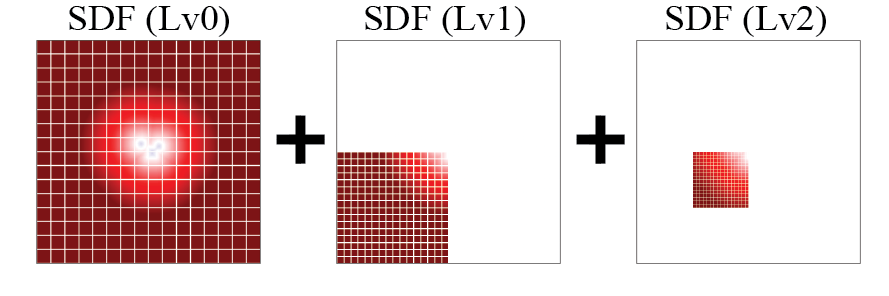
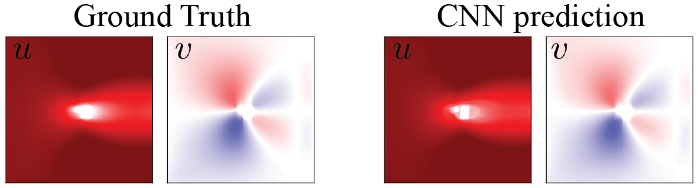

# AMR-Net

_AMR-Net_ is designed to predict steady flows from signed distance functions (SDFs). 
Following the landmarking work by [Guo et al](https://dl.acm.org/doi/10.1145/2939672.2939738), 
we extend the CNN prediction model to be applicable to the flow fields based on multi-resolution meshes. 
For this purpose, we employ the [pix2pixHD](https://github.com/NVIDIA/pix2pixHD) based network to handle the data with multiple resolutions. 


Instead of using high-resolution global inputs, we use _low-resolution global (un-patched)_ data and _high-resolution local (patched)_ data to predict multi-resolution flow fields. 

The inputs of the network are multi-resolutional signed distance functions (SDFs) at Lv0 (256 x 256 resolution, _un-patched low-resolution_), Lv1 (512 x 512 resolution, _patched middle-resolution_) and Lv2 (1024 x 1024 resolution, _patched high-resolution_). 


The predicted high-resolution global flow fields (Lv2, 1024 x 1024 resolution) from multi-resolution patched SDFs are shown as follows.
The major benefit of this method is the memory efficiency and the higher compatibility with the multi-resolution dataset.




# Usage

## Installation
This code relies on the following packages. As a deeplearing framework, we use [PyTorch](https://pytorch.org).
- Install Python libraries
[numpy](https://numpy.org), [PyTorch](https://pytorch.org), [xarray](http://xarray.pydata.org/en/stable/), [horovod](https://github.com/horovod/horovod) and [netcdf4](https://github.com/Unidata/netcdf4-python)

- Clone this repo  
```git clone https://github.com/yasahi-hpc/AMRNet.git```


## Prepare dataset
The 2D flow dataset for AMR-Net has been computed by simulations using the lattice Boltzmann methods (LBMs). The inputs of simulations are signed distance functions (SDFs) and the outputs are 2D flow fields  and . In each simulation, 1-5 objects are placed randomly at the center of the computational domain. The objects are randomly chosen from circles, ellipses, rectangles and roundedrectangles. Each simulation data is stored in a hdf5 file in the following format.
```
<xarray.Dataset>
Dimensions:       (patch_x_lv0: 1, patch_x_lv1: 2, patch_x_lv2: 4, patch_y_lv0: 1, patch_y_lv1: 2, patch_y_lv2: 4, x_lv0: 256, x_lv1: 256, x_lv2: 256, y_lv0: 256, y_lv1: 256, y_lv2: 256)
Coordinates:
  * x_lv0         (x_lv0) int64 0 1 2 3 4 5 6 7 ... 249 250 251 252 253 254 255
  * y_lv0         (y_lv0) int64 0 1 2 3 4 5 6 7 ... 249 250 251 252 253 254 255
  * patch_x_lv0   (patch_x_lv0) int64 0
  * patch_y_lv0   (patch_y_lv0) int64 0
  * x_lv1         (x_lv1) int64 0 1 2 3 4 5 6 7 ... 249 250 251 252 253 254 255
  * y_lv1         (y_lv1) int64 0 1 2 3 4 5 6 7 ... 249 250 251 252 253 254 255
  * patch_x_lv1   (patch_x_lv1) int64 0 1
  * patch_y_lv1   (patch_y_lv1) int64 0 1
  * x_lv2         (x_lv2) int64 0 1 2 3 4 5 6 7 ... 249 250 251 252 253 254 255
  * y_lv2         (y_lv2) int64 0 1 2 3 4 5 6 7 ... 249 250 251 252 253 254 255
  * patch_x_lv2   (patch_x_lv2) int64 0 1 2 3
  * patch_y_lv2   (patch_y_lv2) int64 0 1 2 3
Data variables:
    SDF_lv0       (patch_y_lv0, patch_x_lv0, y_lv0, x_lv0) float32 ...
    x_starts_lv0  (patch_y_lv0, patch_x_lv0) float32 ...
    y_starts_lv0  (patch_y_lv0, patch_x_lv0) float32 ...
    SDF_lv1       (patch_y_lv1, patch_x_lv1, y_lv1, x_lv1) float32 ...
    x_starts_lv1  (patch_y_lv1, patch_x_lv1) float32 ...
    y_starts_lv1  (patch_y_lv1, patch_x_lv1) float32 ...
    SDF_lv2       (patch_y_lv2, patch_x_lv2, y_lv2, x_lv2) float32 ...
    x_starts_lv2  (patch_y_lv2, patch_x_lv2) float32 ...
    y_starts_lv2  (patch_y_lv2, patch_x_lv2) float32 ...
    u_lv0         (patch_y_lv0, patch_x_lv0, y_lv0, x_lv0) float32 ...
    u_lv1         (patch_y_lv1, patch_x_lv1, y_lv1, x_lv1) float32 ...
    u_lv2         (patch_y_lv2, patch_x_lv2, y_lv2, x_lv2) float32 ...
    v_lv0         (patch_y_lv0, patch_x_lv0, y_lv0, x_lv0) float32 ...
    v_lv1         (patch_y_lv1, patch_x_lv1, y_lv1, x_lv1) float32 ...
    v_lv2         (patch_y_lv2, patch_x_lv2, y_lv2, x_lv2) float32 ...
    m             int64 ...
```
The inputs for the model are ```SDF_lv0 - SDF_lv2``` and outputs are ```u_lv0 - u_lv2, v_lv0 - v_lv2```. Each variable has the shape of ```(py, px, Ny, Nx)```, where ```px, py``` are the number of patches in x and y directions. ```Nx, Ny``` are the number of grid points in x and y directions inside a patch. 

The dataset can be downloaded from [Dataset (2000 training data, 250 validation data and 250 test data)](https://zenodo.org/record/5482187#.YThgOC0Rq3A).


## Training
For training, it is recommended to use multiple Nvidia GPUs (12 GB memory or larger). We have tested the model on Nvidia [P100](https://images.nvidia.com/content/pdf/tesla/whitepaper/pascal-architecture-whitepaper.pdf) and [A100](https://images.nvidia.com/aem-dam/en-zz/Solutions/data-center/nvidia-ampere-architecture-whitepaper.pdf) GPUs.
We have prepared 4 versions of models, including
- U-Net (```--model_name UNet```): Conventional U-Net model using un-patched Lv2 SDFs as inputs.
- pU-Net (```--model_name Patched_UNet```): U-Net model using patched Lv2 SDFs as inputs.
- pix2pixHD (```--model_name Pix2PixHD```): Generator of pix2pixHD using un-patched Lv2 SDFs as inputs.
- AMR-Net (```--model_name AMR_Net```): the network explained above using patched Lv2 SDFs as inputs.

The command line arguments corresponding to each model are shown in the parenthesis. 
In addition to the model name, the argument ```-data_dir``` should be the directory path where you placed the dataset (default: ```./dataset```). 
The example job scripts are found in ```./batch_scripts``` which include typical command line argumetns for ```run.py```. 
Depending on your configuration, you may have to modify ```./job.sh``` and ```./batch_scripts/sub*_.sh```. 
You should change the following part inside the job script. For example, number of GPUs (```-npernode, -np```), batch_size (```--batch_size```) and so on. 
```
# Run Horovod example with 4 GPUs
mpirun -x PATH -x LD_LIBRARY_PATH -x PSM2_CUDA=1 -x PSM2_GPUDIRECT=1 \
       --mca pml ob1 -npernode 4 -np 4 \
       -x UCX_MEMTYPE_CACHE=n -x HOROVOD_MPI_THREADS_DISABLE=1 \
       python run.py --batch_size 4 --n_epochs 1 --model_name AMR_Net \
       -data_dir ./dataset \
       --padding_mode replicate --lr 0.0002 --run_number $nb_restart
```

Firstly, you need to prepare your batch script ```./batch_scripts/<your_job_script>``` and modify ```./job.sh```. Then, you can run (or submit) the script by 
```
./job.sh
```
After training, you will find the log file ```log_rst<run_number>.txt``` and the directories ```GeneratedImages``` and ```torch_model_MPI<MPI_procs>``` (for example, ```torch_model_MPI4```). 
In ```GeneratedImages```, you will find subdirectories ```rank<MPI_rank>/<mode>_Lv<level>``` (for example, ```rank0/test_Lv2```), wherein generated flow images are stored. In ```torch_model_MPI<MPI_procs>```, the subdirectory ```<model_name>``` (like ```patched_UNet```) is genertate which stores training result ```flow_cnn_result_rank<MPI_rank>_rst<run_number>.h5``` (for example, ```flow_cnn_result_rank0_rst000.h5```) and Torch state files ```model_<MPI_rank>_<epoch>.pt``` (like ```model_0_000.pt```). 


